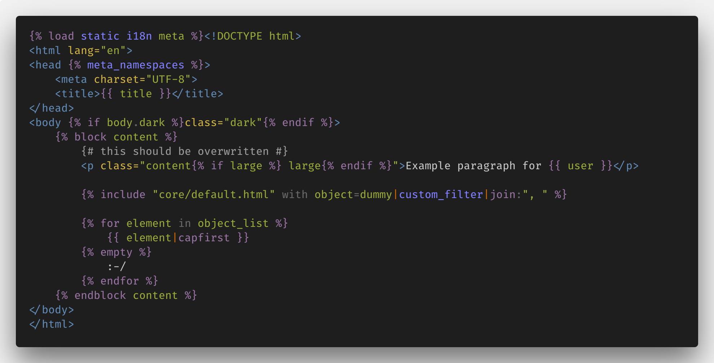

# Django extension for Visual Studio Code

> Beautiful syntax and scoped snippets for perfectionists with deadlines

## Usage

Configure you file association for `Django HTML` in the **Language Mode** menu
or drop this in your settings for more precision:

```json
"files.associations": {
    "**/*.html": "html",
    "**/templates/**/*.html": "django-html",
    "**/templates/**/*": "django-txt",
    "**/requirements{/**,*}.{txt,in}": "pip-requirements"
},
```

Emmet enthusiasts should have this to their configuration as well:

```json
"emmet.includeLanguages": {"django-html": "html"},
```

Dealing with `django.po` files? Consider installing the [gettext extension](https://marketplace.visualstudio.com/items?itemName=mrorz.language-gettext).

## Features

### Go to definition in templates

Ctrl-click or press F12 on the template path in a `include` or `extends` tag
to jump to this template

### Improved syntax

- Adds the filetype `django-html` 
- Adds the filetype `django-txt` for email templates.
- Better syntax with more operators and default keywords:
  - Known default tags and filters
  - Known templatetags namespace from contrib in the  tag
  - Known keywords in tags, like: `as`, `asvar`, `with`, `trimmed`…
- Syntax highlighting everywhere in your HTML document:
  - In the HTML tag itself"
  - In the id, class or any attribute
  - In inline CSS or Javascript code




### Snippets

- No unnecessary new lines
- Support for selected text (when inserting snippet from the menu)
- Support for copied text

## Contributing

### Issues

Something odd? New feature request?
Please [create an issue on Github](https://github.com/vscode-django/vscode-django/issues/new).

### Setup

```bash
git clone https://github.com/vscode-django/vscode-django
cd vscode-django
npm install
code .
```

It’s better to have [TSlint](https://marketplace.visualstudio.com/items?itemName=eg2.tslint) installed.


### Launching the extension debugger

Make sure you have this snippet in `.vscode/launch.json`:

```javascript
{
  "version": "0.2.0",
  "configurations": [
    {
      "name": "Extension",
      "type": "extensionHost",
      "request": "launch",
      "runtimeExecutable": "${execPath}",
      "args": [
        "--extensionDevelopmentPath=${workspaceFolder}"
      ]
    }
  ]
}
```

Press <kbd>F5</kbd> or click on Debug then Start (▶️) to launch the extension host window.

Hack around

Press <kbd>Ctrl</kbd> + <kbd>Shift</kbd> + <kbd>F5</kbd> or 🔄 to reload.

[](https://www.paypal.com/paypalme/batisteo/5)
[](https://github.com/sponsor/batisteo)