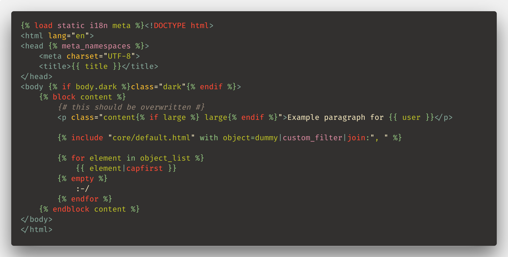

# Django extension for Visual Studio Code

> Beautiful syntax and scoped snippets for perfectionists with deadlines



## Features

### Go to definition in templates

Ctrl+click (cmd+click on MacOS) or press F12 on the template path in a `include` or `extends` tag
to jump to this template

### Snippets

- Support for selected text (when inserting snippet from the menu)
- Support for copied text
- No unnecessary new lines

### Improved syntax

- Adds the filetype `django-html`
- Adds the filetype `django-txt` for email templates.
- Better syntax with more operators and default keywords:
  - Known default tags and filters
  - Known templatetags namespace from contrib in the  tag
  - Known keywords in tags, like: `as`, `asvar`, `with`, `trimmed`…
- Syntax highlighting everywhere in your HTML document:
  - In the HTML tag itself"
  - In the id, class or any attribute
  - In inline CSS or Javascript code

## Tricks

### Gettext and internationalization

Dealing with `django.po` files?
Consider installing the [Gettext extension](https://marketplace.visualstudio.com/items?itemName=mrorz.language-gettext) by MrOrz.

### Emmet

Add the following item to the **Emmet: Include Languages** settings:

| Item          | Value  |
| ------------- | ------ |
| `django-html` | `html` |

## Sponsors

- [tpberntsen](https://github.com/tpberntsen)
- [moving-content](https://github.com/moving-content)

[](https://www.paypal.com/paypalme/batisteo/5)
[](https://github.com/sponsor/batisteo)

## Contributing

### Issues

Something odd? New feature request?
Please [create an issue on Github](https://github.com/vscode-django/vscode-django/issues/new).

### Setup

```bash
git clone https://github.com/vscode-django/vscode-django
cd vscode-django
npm install
code .
```

It’s better to have [TSlint](https://marketplace.visualstudio.com/items?itemName=eg2.tslint) installed.

### Launching the extension debugger

Make sure you have this snippet in `.vscode/launch.json`:

```javascript
{
  "version": "0.2.0",
  "configurations": [
    {
      "name": "Extension",
      "type": "extensionHost",
      "request": "launch",
      "runtimeExecutable": "${execPath}",
      "args": [
        "--extensionDevelopmentPath=${workspaceFolder}"
      ]
    }
  ]
}
```

Press <kbd>F5</kbd> or click on Debug then Start (▶️) to launch the extension host window.

Hack around

Press <kbd>Ctrl</kbd> + <kbd>Shift</kbd> + <kbd>F5</kbd> or 🔄 to reload.
