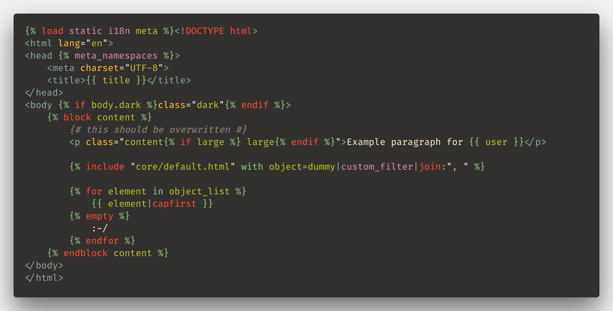
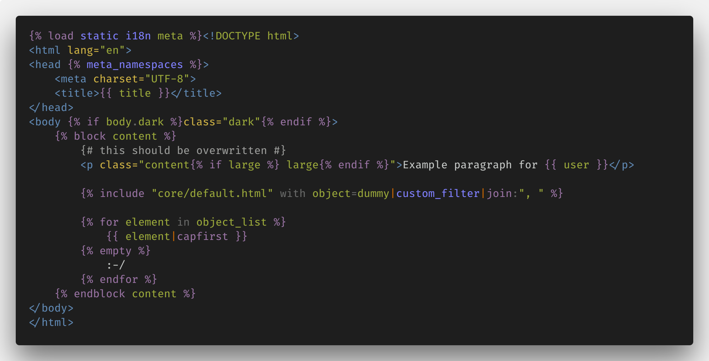

# Django extension for Visual Studio Code

> Beautiful syntax and snippets for perfectionists with deadlines

## Usage

Configure you file association for `Django HTML` in the **Language Mode** menu or drop this in your settings:

```json
"files.associations": {
    "*.html": "django-html",
    "*.txt": "django-txt",
},
```

Emmet enthusiasts should add this to their configuration:

```json
"emmet.includeLanguages": {"django-html": "html"},
```

## Features

### Improved syntax

- Adds the filetype `django-html` 
- Adds the filetype `django-txt` for email templates.
- Better syntax with more operators and default keywords:
  - Known default tags and filters
  - Known templatetags namespace from contrib in the  tag
  - Known keywords in tags, like: `as`, `asvar`, `with`, `trimmed`…
- Syntax highlighting everywhere in your HTML document:
  - In the HTML tag itself"
  - In the id, class or any attribute
  - In inline CSS or Javascript code




### Snippets

- No unnecessary new lines
- Support for selected text (when inserting snippet from the menu)
- Support for copied text